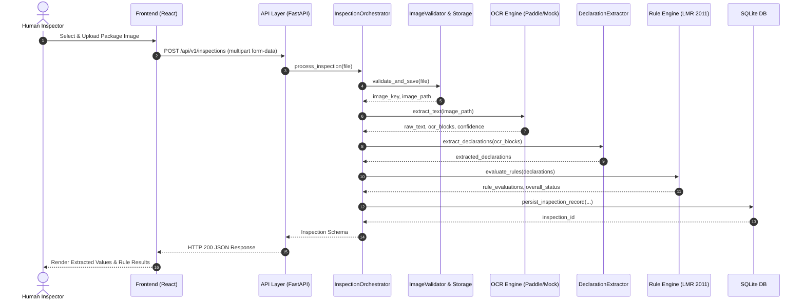

# MetriGuard Architecture Document

## 1. Purpose and Scope
**MetriGuard** is an AI-assisted packaged-commodity inspection system prototype developed for the **SIH26034** problem statement by team **AlgoForge**.

The system automates compliance verification for pre-packaged commodities under the Indian Legal Metrology (Packaged Commodities) Rules, 2011. It accepts package label images, extracts mandatory declarations using OCR and regex pattern extraction, and evaluates compliance using a deterministic, versioned rule engine.

**Scope:**
- Automated single-image inspection lifecycle.
- Image validation, storage, and preprocessing.
- OCR text extraction with bounding boxes and confidence scores.
- Rule-based regex declaration parsing (MRP, Net Quantity, Dates, Manufacturer details, Consumer Care, USP).
- Deterministic compliance rule evaluation (6 LMR 2011 rules).
- Human-in-the-loop manual review interface.
- Inspection history and metrics dashboard.

**Non-Scope:**
- Legal certification or automated law enforcement decisions.
- Multi-image inspection sessions (strictly 1 package image per inspection).
- Fully automated LLM legal decision-making.

## 2. High-Level Architecture
The application follows a decoupled client-server architecture:
- **Frontend:** React 18 single-page application built with Vite, TypeScript, and TailwindCSS.
- **Backend:** FastAPI (Python 3.10+) RESTful service.
- **Database:** Local SQLite database accessed via SQLAlchemy ORM and Alembic migrations.
- **Storage:** Local file system storage for uploaded package images.
- **Processing Services:** Image validator, OpenCV/PIL preprocessor, PaddleOCR engine (with mock fallback), regex declaration extractor, and deterministic rule engine.

```
┌─────────────────────────────────────────────────────────────────────────────┐
│                              FRONTEND (Vite / React 18 / TS)                │
│                                                                             │
│   ┌─────────────────────┐    ┌─────────────────────┐   ┌────────────────┐   │
│   │   ImageUpload.tsx   │    │  DashboardView.tsx  │   │ DetailView.tsx │   │
│   └──────────┬──────────┘    └──────────┬──────────┘   └───────┬────────┘   │
└──────────────┼──────────────────────────┼──────────────────────┼────────────┘
               │ HTTP / REST              │                      │
               ▼                          ▼                      ▼
┌─────────────────────────────────────────────────────────────────────────────┐
│                              BACKEND (FastAPI / Python 3.10+)               │
│                                                                             │
│   ┌─────────────────────────────────────────────────────────────────────┐   │
│   │                      API Layer (backend/app/api)                    │   │
│   │  /api/v1/inspections  │  /api/v1/ocr  │  /api/v1/dashboard/metrics │   │
│   └──────────────────────────────────┬──────────────────────────────────┘   │
│                                      │                                      │
│                                      ▼                                      │
│   ┌─────────────────────────────────────────────────────────────────────┐   │
│   │             InspectionOrchestrator (orchestrator.py)               │   │
│   └───────┬──────────────┬──────────────┬──────────────┬─────────┬──────┘   │
│           │              │              │              │         │          │
│           ▼              ▼              ▼              ▼         ▼          │
│     ImageValidator  OCRService    Extractor     RuleEngine   Storage        │
│      (PIL / MIME)   (Paddle/Mock)  (Regex)     (LMR 2011)   (UUID keys)     │
└───────────┬──────────────┬──────────────┬──────────────┬─────────┬──────────┘
            │              │              │              │         │
            ▼              ▼              ▼              ▼         ▼
┌─────────────────────────────────────────────────────────────────────────────┐
│                               PERSISTENCE                                   │
│  SQLite (metriguard.db)  │  Local Image Store (data/uploads/)               │
└─────────────────────────────────────────────────────────────────────────────┘
```

## 3. Component Responsibilities

| Component / Module | Location | Primary Responsibility |
| :--- | :--- | :--- |
| **API Entry Point** | [`backend/app/main.py`](file:///c:/Users/Sagnik/Documents/GitHub repos/metriguard/backend/app/main.py) | FastAPI app initialization, CORS middleware, route mounting, static file serving (`/uploads`). |
| **Inspection Orchestrator** | [`backend/app/services/inspection_orchestrator.py`](file:///c:/Users/Sagnik/Documents/GitHub repos/metriguard/backend/app/services/inspection_orchestrator.py) | Coordinates the 5-step lifecycle: validation, storage, OCR, extraction, and rule evaluation. |
| **Image Validator** | [`backend/app/services/image_validator.py`](file:///c:/Users/Sagnik/Documents/GitHub repos/metriguard/backend/app/services/image_validator.py) | Validates MIME type, file extension, max size (10MB), and PIL structural integrity. |
| **Storage Manager** | [`backend/app/services/storage.py`](file:///c:/Users/Sagnik/Documents/GitHub repos/metriguard/backend/app/services/storage.py) | Generates sanitized UUID file keys and securely writes images to disk. |
| **OCR Service** | [`backend/app/services/ocr/service.py`](file:///c:/Users/Sagnik/Documents/GitHub repos/metriguard/backend/app/services/ocr/service.py) | Executes preprocessor and passes images to PaddleOCR or MockOCR provider. |
| **Declaration Extractor** | [`backend/app/services/extraction/extractor.py`](file:///c:/Users/Sagnik/Documents/GitHub repos/metriguard/backend/app/services/extraction/extractor.py) | Uses regular expression patterns ([`patterns.py`](file:///c:/Users/Sagnik/Documents/GitHub repos/metriguard/backend/app/services/extraction/patterns.py)) to identify mandatory fields. |
| **AI Extractor (Optional)** | [`backend/app/services/ai_extractor.py`](file:///c:/Users/Sagnik/Documents/GitHub repos/metriguard/backend/app/services/ai_extractor.py) | *Optional/Fallback module* for LLM-assisted extraction when regex yields low confidence. |
| **Rule Engine** | [`backend/app/services/rules/engine.py`](file:///c:/Users/Sagnik/Documents/GitHub repos/metriguard/backend/app/services/rules/engine.py) | Executes versioned compliance rules against extracted declarations. |
| **LMR 2011 Rules** | [`backend/app/services/rules/lmr_2011/`](file:///c:/Users/Sagnik/Documents/GitHub repos/metriguard/backend/app/services/rules/lmr_2011) | 6 rule modules evaluating Entity, Net Qty, Dates, MRP, Consumer Care, and USP. |
| **Database Models** | [`backend/app/db/models.py`](file:///c:/Users/Sagnik/Documents/GitHub repos/metriguard/backend/app/db/models.py) | SQLAlchemy models: `Inspection`, `OCRResult`, `ExtractedDeclaration`, `RuleEvaluation`. |
| **Frontend API Client** | [`frontend/src/api/client.ts`](file:///c:/Users/Sagnik/Documents/GitHub repos/metriguard/frontend/src/api/client.ts) | Axios wrapper for backend communication. |
| **Frontend Views** | [`frontend/src/components/`](file:///c:/Users/Sagnik/Documents/GitHub repos/metriguard/frontend/src/components) | UI views for image upload, verification, history dashboard, and detailed inspection. |

## 4. Frontend Architecture
- **Framework:** React 18 + Vite + TypeScript.
- **Styling:** TailwindCSS with custom design system variables in [`index.css`](file:///c:/Users/Sagnik/Documents/GitHub repos/metriguard/frontend/src/index.css).
- **Icons:** Lucide React icons.
- **State Management:** React component local state (`useState`, `useEffect`) and callback handlers.
- **Views & Routing:**
  - `ImageUpload.tsx`: Drag-and-drop file uploader, real-time image preview, processing status progress bar, declaration verification modal/form, and rule result viewer.
  - `DashboardView.tsx`: Displays summary metric cards (Total, Compliant, Non-Compliant, Manual Review), status filter tabs, search filter, and historical inspection table.
  - `InspectionDetailView.tsx`: Detailed view of a single inspection showing original image, extracted bounding boxes, declaration comparison, rule evidence, and manual review controls.

## 5. Backend Architecture
- **Framework:** FastAPI (ASGI server via Uvicorn).
- **Configuration:** `pydantic-settings` reading environment variables from `.env` ([`backend/app/core/config.py`](file:///c:/Users/Sagnik/Documents/GitHub repos/metriguard/backend/app/core/config.py)).
- **API Endpoints:**
  - `POST /api/v1/inspections`: Upload image and execute full 5-step inspection pipeline.
  - `GET /api/v1/inspections`: Query inspection history with status and pagination filters.
  - `GET /api/v1/inspections/{id}`: Retrieve a complete inspection record by ID.
  - `PATCH /api/v1/inspections/{id}/status`: Manual review status override.
  - `DELETE /api/v1/inspections/{id}`: Delete an inspection record and associated stored image.
  - `GET /api/v1/dashboard/metrics`: Summary statistics for dashboard cards.
  - `GET /health`, `GET /api/v1/health`: System health check endpoints.

## 6. Upload and Inspection Lifecycle
Strict enforcement: **One inspection session contains exactly one uploaded package image.**

```
[ User Uploads Image ]
          │
          ▼
1. Image Validation (image_validator.py) ──► Validates extension, MIME, size <= 10MB, PIL header
          │
          ▼
2. Image Storage (storage.py) ────────────► Generates UUID prefix, saves to backend/data/uploads/
          │
          ▼
3. OCR & Preprocessing (ocr/service.py) ──► Enhances image, extracts text blocks & bounding boxes
          │
          ▼
4. Declaration Extraction (extractor.py) ─► Applies regex patterns to extract mandatory fields
          │
          ▼
5. Compliance Evaluation (rules/engine.py)► Runs LMR 2011 rule set against extracted fields
          │
          ▼
6. DB Persistence (db/crud.py) ───────────► Persists single Inspection + 1:1 child records
          │
          ▼
[ Return Inspection Response ]
```

## 7. OCR and Image-Processing Pipeline
- **Preprocessor:** [`backend/app/services/ocr/preprocessor.py`](file:///c:/Users/Sagnik/Documents/GitHub repos/metriguard/backend/app/services/ocr/preprocessor.py)
  - Applies grayscale conversion, contrast adjustment, bilateral filtering, and adaptive thresholding using OpenCV.
  - Handles image orientation correction and bounding box normalization.
- **Provider Factory:** [`backend/app/services/ocr/factory.py`](file:///c:/Users/Sagnik/Documents/GitHub repos/metriguard/backend/app/services/ocr/factory.py)
  - `PaddleOCRProvider`: Uses `paddleocr` engine when installed for GPU/CPU OCR inference.
  - `MockOCRProvider`: Fallback provider returning deterministic mock OCR bounding boxes for offline testing or environments without PaddleOCR dependencies.

---

## 8. Declaration-Extraction Pipeline
- **Regex Pattern Matching:** [`backend/app/services/extraction/patterns.py`](file:///c:/Users/Sagnik/Documents/GitHub repos/metriguard/backend/app/services/extraction/patterns.py)
  - Mandatory fields: Maximum Retail Price (MRP), Net Quantity, Date of Manufacture/Packing/Import, Expiry/Best Before Date, Manufacturer/Packer/Importer Details, Consumer Care Contact, Unit Sale Price (USP).
- **Extractor Logic:** [`backend/app/services/extraction/extractor.py`](file:///c:/Users/Sagnik/Documents/GitHub repos/metriguard/backend/app/services/extraction/extractor.py)
  - Scans OCR text blocks line-by-line and contextually across adjacent lines.
  - Computes confidence scores per extracted field based on regex match precision and bounding box OCR confidence.
- **AI Extractor (Optional):** [`backend/app/services/ai_extractor.py`](file:///c:/Users/Sagnik/Documents/GitHub repos/metriguard/backend/app/services/ai_extractor.py)
  - *Optional fallback component* utilizing LLM vision APIs (Gemini/OpenAI) to assist extraction on unstructured packaging text.

## 9. Deterministic Compliance Rule Engine
Compliance evaluation is completely separated from OCR and AI extraction. The rule engine ([`backend/app/services/rules/engine.py`](file:///c:/Users/Sagnik/Documents/GitHub repos/metriguard/backend/app/services/rules/engine.py)) processes structured extracted declarations against versioned legal rules.

### Implemented Rule Set: LMR 2011 (`backend/app/services/rules/lmr_2011/`)
1. `Rule 6(1)(a)` - Manufacturer / Packer / Importer Entity Name and Address ([`r06_1_a_entity.py`](file:///c:/Users/Sagnik/Documents/GitHub repos/metriguard/backend/app/services/rules/lmr_2011/r06_1_a_entity.py))
2. `Rule 6(1)(c)` - Net Quantity Declaration and Standard Unit compliance ([`r06_1_c_net_qty.py`](file:///c:/Users/Sagnik/Documents/GitHub repos/metriguard/backend/app/services/rules/lmr_2011/r06_1_c_net_qty.py))
3. `Rule 6(1)(d)` - Month and Year of Manufacture / Packing / Import ([`r06_1_d_date.py`](file:///c:/Users/Sagnik/Documents/GitHub repos/metriguard/backend/app/services/rules/lmr_2011/r06_1_d_date.py))
4. `Rule 6(1)(e)` - Maximum Retail Price (MRP) with inclusive of all taxes tax statement ([`r06_1_e_mrp.py`](file:///c:/Users/Sagnik/Documents/GitHub repos/metriguard/backend/app/services/rules/lmr_2011/r06_1_e_mrp.py))
5. `Rule 6(1)(g)` - Consumer Care Details (Name, Address, Phone / Email) ([`r06_1_g_consumer.py`](file:///c:/Users/Sagnik/Documents/GitHub repos/metriguard/backend/app/services/rules/lmr_2011/r06_1_g_consumer.py))
6. `Rule 6(11)` - Unit Sale Price (USP) declaration for applicable commodities ([`r06_11_usp.py`](file:///c:/Users/Sagnik/Documents/GitHub repos/metriguard/backend/app/services/rules/lmr_2011/r06_11_usp.py))

## 10. Confidence and Manual-Review Flow
The overall inspection status is derived deterministically:
- **`COMPLIANT`**: All mandatory rules evaluate to `PASSED` with overall extraction confidence >= `0.70`.
- **`NON_COMPLIANT`**: One or more mandatory rules evaluate to `FAILED` with unambiguous evidence.
- **`MANUAL_REVIEW`**: Any mandatory field is missing, extraction confidence is below `0.70`, or ambiguous values are flagged.
- **`FAILED`**: System or processing failure during file validation, storage, or OCR execution.

Human inspectors can inspect flagged records in the frontend interface and issue a manual status override (`PATCH /api/v1/inspections/{id}/status`).

## 11. Evidence and Bounding-Box Model
- Every extracted declaration field tracks bounding box coordinates `[x_min, y_min, x_max, y_max]` relative to the original image dimensions.
- Every rule evaluation result includes:
  - `passed` (boolean)
  - `status` (`PASSED`, `FAILED`, `MANUAL_REVIEW`, `SKIPPED`)
  - `evidence_text` (exact OCR text snippet used as evidence)
  - `severity` (`CRITICAL`, `MAJOR`, `MINOR`, `WARNING`)
  - `details_json` (structured rule parameters and threshold metrics)

## 12. Database Model
- **Engine:** SQLite (`backend/data/metriguard.db`).
- **ORM:** SQLAlchemy with strict 1:1 foreign key constraints enforcing the single-image inspection contract.
- **Schema (`backend/app/db/models.py`):**
  - `Inspection`: Core record (`id`, `image_key`, `image_path`, `original_filename`, `status`, `overall_confidence`, `created_at`, `updated_at`).
  - `OCRResult`: Stores full OCR text, raw blocks JSON, and average confidence score.
  - `ExtractedDeclaration`: Stores parsed key-value declarations and field confidences.
  - `RuleEvaluation`: Stores individual rule execution results and evidence.

## 13. Image-Storage Model
- Uploaded files are stored on disk in [`backend/data/uploads/`](file:///c:/Users/Sagnik/Documents/GitHub repos/metriguard/backend/data/uploads).
- Storage key format: `{uuid4().hex}_{sanitized_original_filename}`.
- Path traversal prevention: File key paths are strictly validated using `is_relative_to(UPLOADS_DIR)`.
- Static File Mount: Backend mounts `/uploads` as a static directory for frontend image rendering.

## 14. API Communication
All client-server interactions take place over RESTful HTTP JSON APIs defined in `backend/app/api`:

```
POST /api/v1/inspections ──────► Upload multipart image file & execute inspection
GET  /api/v1/inspections ──────► Retrieve paginated inspection history
GET  /api/v1/inspections/{id} ──► Fetch complete inspection detail record
PATCH /api/v1/inspections/{id}/status ──► Update status after manual human review
DELETE /api/v1/inspections/{id} ────────► Delete inspection & purge stored image file
GET  /api/v1/dashboard/metrics ─────────► Summary counts for dashboard overview
```

## 15. Error and Failure Handling
- **HTTP Exception Handler:** Standardized FastAPI HTTP error responses for client errors (e.g. 400 Bad Request for invalid image types/corrupted files, 404 Not Found for missing inspection IDs).
- **Validation Fallback:** File upload errors prevent pipeline execution and yield clear error messages.
- **OCR Failure Graceful Degradation:** If PaddleOCR fails or is uninstalled, `OCRProviderFactory` degrades to `MockOCRProvider` or marks inspection status as `FAILED`.

## 16. Security Boundaries
- **Validation:** Strict MIME type, file extension, and PIL structural byte verification.
- **Sanitization:** Strict filename regex cleanup and UUID prefixing.
- **Path Traversal Protection:** `Path.is_relative_to` verification prevents relative path directory traversal (`../`).
- **CORS Boundary:** Restricted via `CORS_ORIGINS` setting (`http://localhost:5173`).
- **Open Access Prototype:** Backend currently operates without user authentication or role-based access control (RBAC).

## 17. Deployment Architecture
- **Development Setup:** Native Windows local setup executed via [`start.ps1`](file:///c:/Users/Sagnik/Documents/GitHub repos/metriguard/start.ps1), running FastAPI on port 8000 and Vite dev server on port 5173.
- **Production Build:** Vite produces a static bundle in `frontend/dist`. FastAPI or Nginx can serve static frontend assets alongside backend API processes.

---

## 18. Important Design Decisions
1. **Single-Image Lifecycle:** Decided to strictly enforce 1 package image per inspection session to avoid ambiguous multi-image state contamination.
2. **Deterministic Compliance vs LLM:** Legal rule evaluation is strictly deterministic and version-controlled (`lmr_2011`), avoiding non-deterministic LLM hallucinations for compliance decisions.
3. **Decoupled OCR Engine:** Abstracted behind `OCRProvider` interface, allowing seamless switching between PaddleOCR, Tesseract, and Mock test providers.
4. **Human-in-the-Loop:** Inspections with low OCR confidence or missing mandatory declarations default to `MANUAL_REVIEW` status rather than guessing.

## 19. Known Architectural Limitations
- **Single-Node Storage:** Images and SQLite database are stored locally on single server disk (not horizontally scalable across multiple instances without shared storage / cloud DB).
- **Unauthenticated Prototype:** Lacks user login, session tokens, or organization tenant boundaries.
- **CPU-Bound OCR:** PaddleOCR processing runs synchronously in worker threads; high request volumes require async task queues (e.g. Celery / Redis), which are intentionally omitted in current prototype scope.

## 20. System Sequence Diagram


